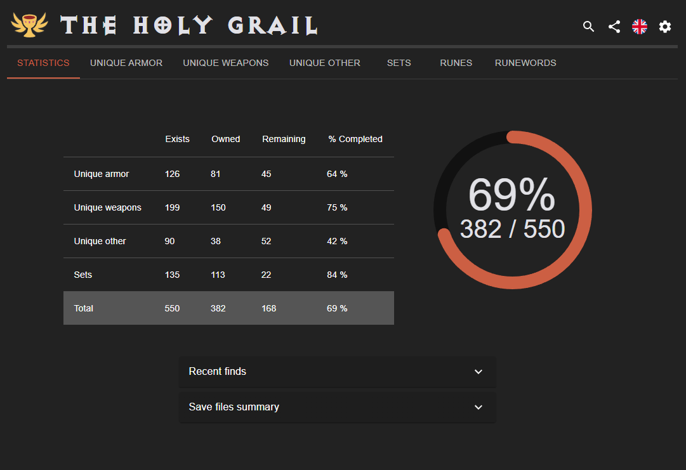
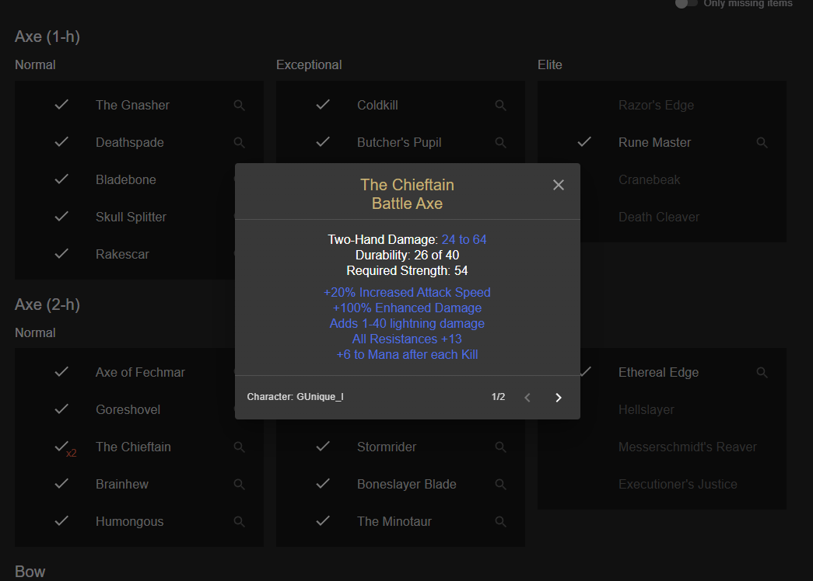
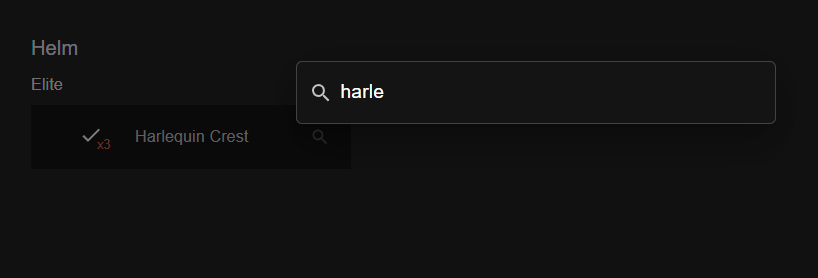
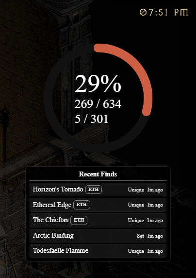
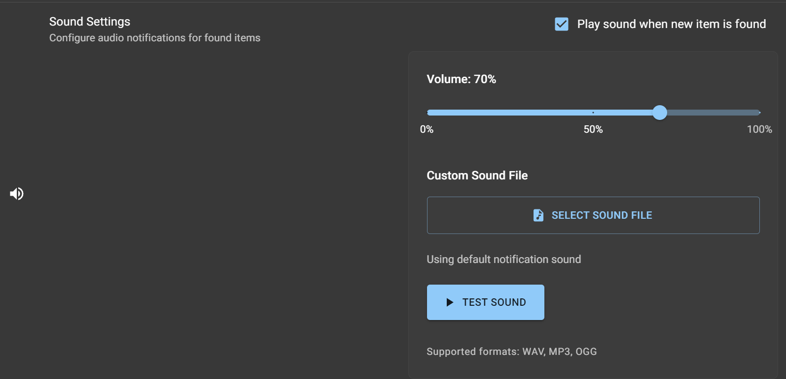

# The Holy Grail RotW

Fork of [pyrosplat/TheHolyGrail](https://github.com/pyrosplat/TheHolyGrail) focused on **Diablo II: Resurrected - Reign of the Warlock (RotW)** support and quality of life improvements.

This desktop app scans offline save files, tracks Holy Grail progress, and provides item-level inspection in one place.  
Stack: **Electron + React + TypeScript**

<p align="center">
  
</p>

## Recent Improvements

- Direct inspect action for owned items from list/search results (magnifier icon).
- Faster search flow:
  - `Ctrl+F` always opens spotlight search.
  - Secondary search shortcut is configurable in settings and can be recorded as a custom key combination.
  - `Enter` opens item details when there is a single visible match.
  - `Esc` clears active search.
- Better item details rendering:
  - Improved base defense/damage presentation.
  - Combined min/max damage lines for readability.
  - Cleaner repair stat text (fraction display).
- Stale list/search state is now refreshed when grail settings change.
- Improved parsed stat ordering for shared stash item details.

## Feature Overview

- Auto scan and watch save folders for file changes.
- RotW support:
  - Warlock grail toggle.
  - RotW uniques, sets, runewords, and charms.
- Item inspection:
  - View full rolled stats for owned items.
  - Jump between all owned copies.
- Grail tracking modes:
  - Normal / Ethereal / Both / Each.
  - Softcore / Hardcore / Manual.
- Optional persistent history (`Persist found on drop`) with "Previously found" markers.
- Recent finds tracking (in-app + overlay), including clear action.
- Overlay window for live progress (size, font, and recent-finds controls).
- Sound notifications for new finds (default or custom `.wav` / `.mp3` / `.ogg`).
- Runeword calculator link prefilled from currently available runes.
- Share progress snapshot (copy to clipboard or save image).
- Built-in update check and installer download from GitHub releases.

## Known Limitations

- Shared stash runes tab currently tracks rune **presence**, not stack quantity.
- Web Sync is currently disabled in this build.

## Quick Start (Users)

1. Download the latest build from [Releases](https://github.com/csvon/TheHolyGrail-RotW/releases/latest).
2. Launch the app.
3. Click `Select folder to read saves from` and choose your Diablo II save directory.
4. Optional: switch to Manual mode from the welcome screen if you do not want file scanning.

## Build and Run (Development)

Prerequisites:

- Node.js
- Yarn 1.x

Commands:

```bash
yarn install    # install dependencies
yarn start      # run in development
yarn package    # package app
yarn build      # package + windows installer build
yarn build-win  # windows installer only
```

## Screenshots

<p align="left">
  
</p>

<p align="left">
  
</p>

<p align="left">
  
</p>

<p align="left">
  
</p>

<p align="left">
  
</p>

## Related Projects

- [pyrosplat/TheHolyGrail](https://github.com/pyrosplat/TheHolyGrail)
- [pyrosplat/TheHolyGrail-Public-Tracker](https://github.com/pyrosplat/TheHolyGrail-Public-Tracker)

## License

[ISC](https://choosealicense.com/licenses/isc/)
